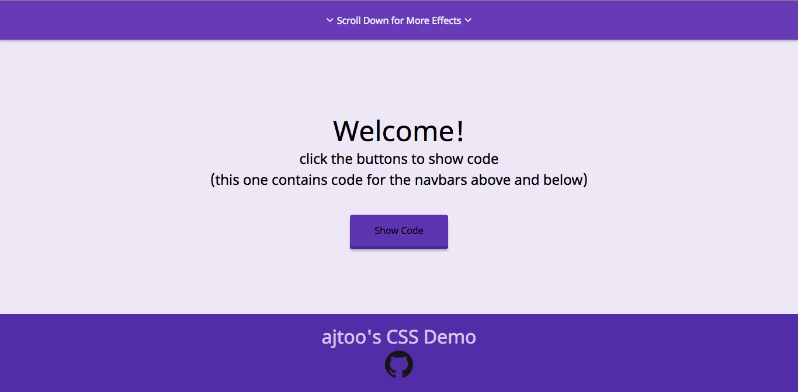
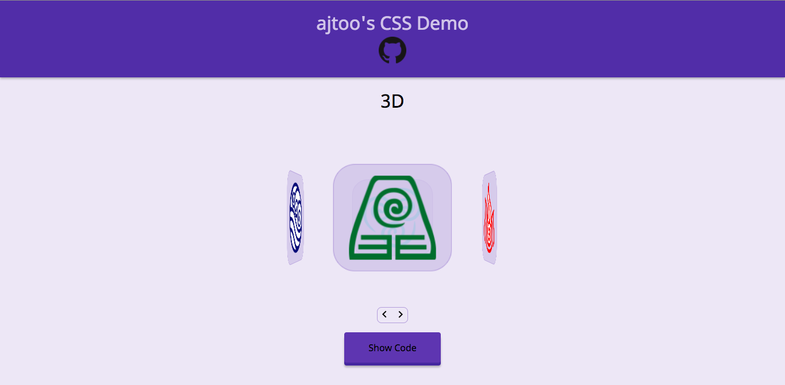

# CSS Demo

## Background

This is a demo of some of my CSS skills and a place for me to experiment with new things (primarily 3D). Everything was built without libraries or frameworks using vanilla CSS/HTML/JS. Syntax highlighting for "show code" is provided by highlight.js.

### Initial View

### Feature View

## Architecture and Technologies

Vanilla CSS/HTML/JS, highlight.js

## Bonus features

There are many places to take this project and features to develop. 

- [ ] More thorough browser support/consistency
- [ ] Drag and Drop
- [ ] Mouse Drag for rotating around 3D object
- [ ] 3D butterfly flying around page

